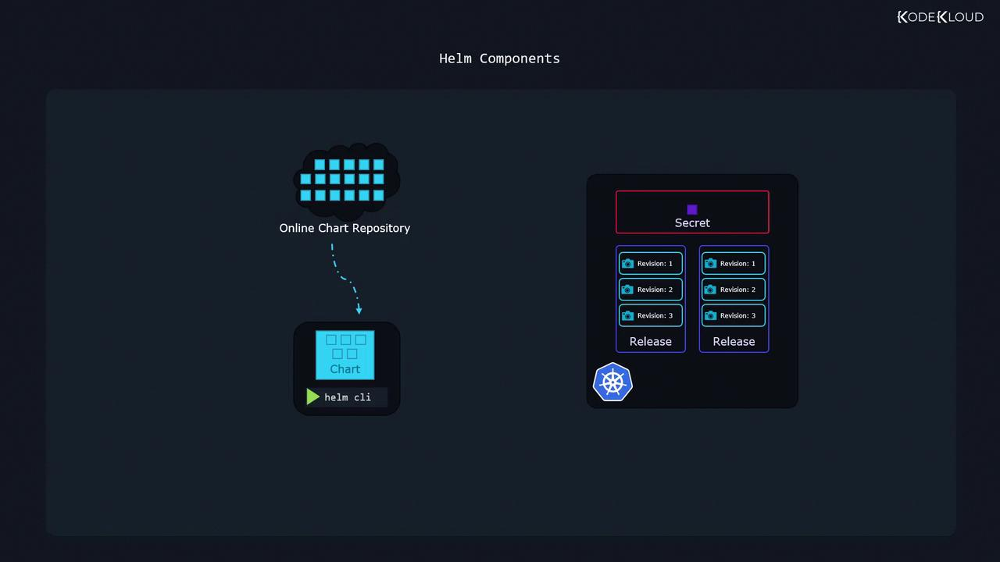

# ⚙️ Helm Key Components

1. **Helm CLI**  
   The Helm command-line utility runs on your local machine, enabling you to install charts, upgrade releases, roll back changes, and perform other operations.

2. **Charts**  
   Charts are packages containing all the instructions Helm needs to create the Kubernetes objects required by an application.  
   They serve as reusable deployment packages and are available publicly from various repositories.

3. **Releases**  
   A release is created when a chart is deployed to your cluster.  
   It represents a single installation of an application based on a Helm chart.  
   Each time you perform an action — such as an upgrade or configuration change — a new revision (or snapshot) is generated, enabling independent management of multiple application versions.

4. **Metadata**  
   Helm stores release metadata, including chart details and revision history, as Secrets within your Kubernetes cluster.  
   This ensures that the deployment history remains accessible to everyone working on the cluster.





## 📜 Helm Charts and Templating

Helm charts bundle not only Kubernetes manifest files but also **powerful templating capabilities** that provide flexibility and customization.

### Example: HelloWorld Application with Nginx
Consider a simple HelloWorld application running an Nginx web server.  
This application uses two primary Kubernetes objects:
- **Deployment**
- **Service**

The deployment template uses Helm’s templating syntax to substitute values defined in a separate configuration file (`values.yaml`).

---

```yaml
# service.yaml
apiVersion: v1
kind: Service
metadata:
  name: hello-world
spec:
  type: NodePort
  ports:
    - port: 80
      targetPort: http
      protocol: TCP
      name: http
  selector:
    app: hello-world

# deployment.yaml
apiVersion: apps/v1
kind: Deployment
metadata:
  name: hello-world
spec:
  replicas: {{ .Values.replicaCount }}
  selector:
    matchLabels:
      app: hello-world
  template:
    metadata:
      labels:
        app: hello-world
    spec:
      containers:
        - name: nginx
          image: {{ .Values.image.repository }}
          ports:
            - name: http
              containerPort: 80
              protocol: TCP

# values.yaml
replicaCount: 1
image:
  repository: nginx


💡 How It Works

values.yaml stores dynamic configuration values such as replica count and image repository.

Templates (deployment.yaml, service.yaml) reference these values with {{ .Values.key }}.

This allows customization without modifying the template files.


## 🚀 Managing Releases with Helm

One of Helm's standout features is its ability to manage **multiple releases** from the same chart.  

For example, you might deploy **two distinct instances** of a WordPress website:
- One for **external customers** (production)
- Another for **internal development**

Although both releases use the **same chart**, they are managed independently — each with its own **configuration** and **revision history**.

---

### 📌 Example: Installing Two Independent Releases

```bash
# Install the first release with a custom name 'my-site'
helm install my-site bitnami/wordpress

# Install a second independent release named 'my-second-site'
helm install my-second-site bitnami/wordpress
💡 Tip:
Using the same chart source for different environments (e.g., production and development) simplifies management while keeping configurations isolated.


# ⚙️ Helm Structure


---

## 📄 Chart.yaml and Helm Chart Structure

Every Helm chart includes a **Chart.yaml** file that stores metadata about the chart.  
This metadata covers details like:

- Chart API version
- Application version
- Chart version
- Name and description
- Dependencies
- Additional metadata for discovery and reference

> **Note:**  
> Helm 3 charts use `apiVersion: v2`, while Helm 2 charts use `apiVersion: v1`.  
> This versioning ensures Helm interprets features (e.g., dependencies, type) correctly.

---

### 📝 Example: Chart.yaml for WordPress
```yaml
apiVersion: v2
appVersion: 5.8.1
version: 12.1.27
name: wordpress
description: Web publishing platform for building blogs and websites.
type: application
dependencies:
  - condition: mariadb.enabled
    name: mariadb
    repository: https://charts.bitnami.com/bitnami
    version: 9.x.x
keywords:
  - application
  - blog
  - wordpress
maintainers:
  - email: containers@bitnami.com
    name: Bitnami
home: https://github.com/bitnami/charts/tree/master/bitnami/wordpress
icon: https://bitnami.com/assets/stacks/wordpress/img/wordpress-stack-220x234.png


🔍 Key Elements in Chart.yaml
apiVersion – Chart API version (v2 for Helm 3, v1 for Helm 2).

appVersion – Version of the packaged application (e.g., WordPress 5.8.1).

version – Chart version, used to track chart changes independently of the app version.

name, description, type – Chart’s name (wordpress), description, and type (application).

dependencies – Lists dependent charts (e.g., MariaDB in this example).

keywords, maintainers, home, icon – Extra metadata for search, authorship, and reference.

📂 Typical Helm Chart Directory Structure
bash
Copy
Edit
mychart/
│── Chart.yaml        # Chart metadata
│── values.yaml       # Default configuration values
│── templates/        # Kubernetes manifest templates
│── charts/           # Optional: dependent charts
└── README.md         # Optional: chart documentation
This structure ensures a Helm chart is self-contained, reusable, and easy to share.