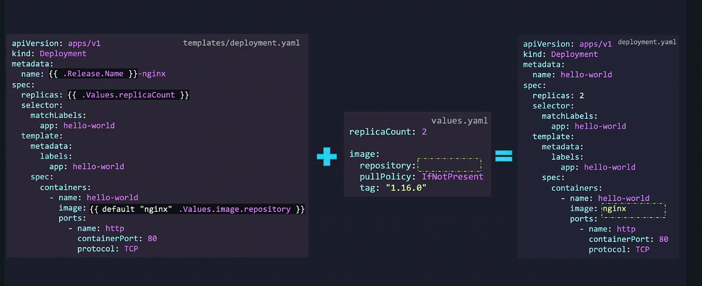

## Default Function?

Revisiting the earlier issue of a missing image repository value: if the value is not supplied in values.yaml or via the command line, the rendered manifest will omit an image, potentially causing a pod to fail. To ensure that your deployment always includes a valid image, use the default function. By specifying a default value (enclosed in quotes to treat it as a string), Helm will use "nginx" if no repository value is provided.

